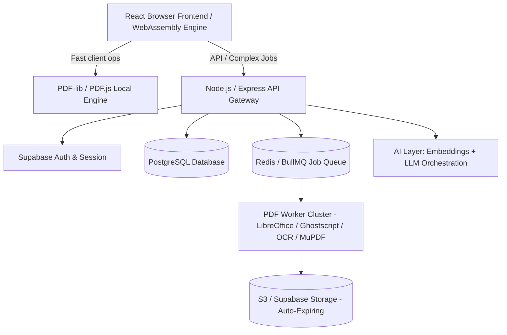

# Custumu — Product Specification & Technical Architecture

## 1. Executive Summary

- **Product Name:** Custumu
- **Domain:** [custumu.com](https://custumu.com)
- **Positioning:** "The AI Workspace for Documents & PDFs" — Moving beyond fragmented 40-button utility sites into a unified, intelligent canvas where users drop any document and tell Custumu what to do in natural language or through visual manipulation.

---

## 2. Core Pillars & Capabilities

### 2.1 Layer 1: Everyday PDF Utilities (SEO Acquisition Engine)

Each of these core tools serves both as an SEO acquisition landing page (e.g. `custumu.com/merge-pdf`, `custumu.com/compress-pdf`) and a seamlessly switchable mode inside the unified workspace:

- **Organize:** Merge, Split, Extract Pages, Delete, Reorder, Rotate, Crop, Duplicate.
- **Convert:** PDF ⇄ Word, Excel, PowerPoint, JPG, PNG, HTML.
- **Optimize & Security:** Compress (with target MB preset), Flatten, Convert to PDF/A, Password protect, Unlock, Redact, Remove metadata.
- **Edit & Annotate:** Add/Edit text, Add images/logos, Freehand draw, Highlight, Whiteout, Watermarks, Bates numbering, Headers/Footers.
- **Forms & Signatures:** Fill interactive PDF forms, create form fields, e-Signature pad, request signee flow.

### 2.2 Layer 2: AI Differentiator & Document Intelligence

- **Interactive Chat with PDF:**
  - Semantic Q&A with direct citation links to specific pages and bounding boxes.
  - Automatic summarization (Executive summary, bullet takeaways, legal risk analysis).
  - Obligation and clause tracking (Payment terms, termination clauses, indemnity).
- **Multi-Document Comparison:**
  - Upload two versions of a contract/document.
  - Automated visual & semantic diff showing added, removed, and modified clauses (e.g., _"Payment grace period reduced from 30 to 14 days"_).

### 2.3 Layer 3: AI-Driven Document Action Engine

Users can trigger document modifications via natural language commands:

- _"Delete page 2 and 4, add a cover page, and place our logo in the top right."_
- _"Redact all Social Security Numbers and email addresses across all 50 pages."_
- _"Resize margins and compress to under 2MB for email attachment."_

### 2.4 Layer 4: PDF → Structured Data Extraction

- **Batch Processing:** Upload 1 to 100+ invoices, receipts, or bank statements.
- **Schema-Based Extraction:**
  - Invoices: Invoice #, Vendor, Date, Line Items, Taxes, Total.
  - Statements: Transaction date, Description, Amount, Running Balance.
  - Resumes: Candidate name, contact info, skills, experience history.
- **Export Formats:** Excel (.xlsx), CSV, JSON, direct Webhook/API dispatch.

### 2.5 Layer 5: High-Precision OCR Engine

- Auto-detect scanned/image-only PDFs.
- Convert image scans into searchable, selectable PDF/A documents with text layer alignment.
- Enables downstream AI search, copy-paste, and natural language editing on physical scans.

---

## 3. Privacy Architecture: Dual-Engine Model

Custumu enforces a transparent, trust-building dual processing model:

| Capability          | Private Mode (Local WebAssembly)                                         | Cloud Mode (Secure Enclave)                                              |
| ------------------- | ------------------------------------------------------------------------ | ------------------------------------------------------------------------ |
| **Location**        | 100% Client-side (Browser RAM)                                           | Encrypted TLS Pipeline                                                   |
| **Data Retention**  | Zero bytes sent to servers                                               | Auto-deleted within 60 mins or immediately after job                     |
| **Supported Tasks** | Merge, Split, Rotate, Delete pages, Local annotations, Light compression | High-compression, OCR, PDF ⇄ Office, AI Chat, Structured data extraction |
| **Target User**     | Privacy-conscious legal/finance teams                                    | Heavy duty business automations & AI workflows                           |

---

## 4. Unified Studio Workspace UI Design

```
+-----------------------------------------------------------------------------------+
|  [Logo] Custumu   | File: Master_Agreement_v2.pdf (12 Pages) | [Privacy: Local]    |
+-------------------+---------------------------------------------------------------+
| [Pages Panel]     | [Canvas Workspace - Multi-Tool Toolbar]        | [AI Assistant]  |
|                   | [Select] [Text] [Draw] [Sign] [Redact] [Zoom]  |                 |
| [Thumbnails]      | ---------------------------------------------- | Chat / Commands |
| +---------------+ |                                                | "What would you |
| | Page 1        | |            [ PDF Page Canvas ]                 |  like to do?"   |
| +---------------+ |                                                |                 |
| | Page 2        | |  Highlighted Clause:                           | Quick Actions:  |
| +---------------+ |  "Section 4. Termination..."                   | [Summarize]     |
| | Page 3        | |                                                | [Extract Table] |
| +---------------+ |                                                | [Compress <5MB] |
| [Add Page]        |                                                |                 |
| [Delete Selected] |                                                | [Input field...] |
+-------------------+------------------------------------------------+-----------------+
```

---

## 5. System & Service Architecture



---

## 6. API Surface (Public Developer & Platform API)

- `POST /v1/pdf/compress` — Compress PDF with target size or quality profiles
- `POST /v1/pdf/convert` — Convert between PDF and DOCX, XLSX, PPTX, Images
- `POST /v1/pdf/ocr` — OCR scanned PDFs to searchable PDF or text
- `POST /v1/pdf/extract` — Extract structured schema (tables, invoices, forms)
- `POST /v1/pdf/merge` — Merge multiple PDF streams into one
- `POST /v1/pdf/compare` — Compare two PDF documents and return structural/semantic diffs
- `POST /v1/ai/chat` — Contextual chat with embedded PDF document
